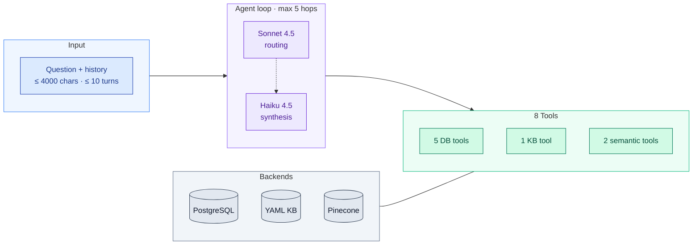

# ELH Semantic Search

> Master's Thesis · Alma Mater Studiorum Università di Bologna
> Supervisor: Prof. Enrico Gallinucci · In collaboration with Erasmus Life Housing

An **Agentic RAG** system that lets students query Erasmus Life Housing's
data (operational database, property descriptions, and student reviews)
in natural language. An LLM-driven agent autonomously selects among
eight registered tools — five structured DB tools, one curated knowledge
base, and two semantic-search wrappers — chains them across multiple
hops, and delivers grounded answers in any of six languages with
optional multi-turn conversation memory.

---

## Context

**Erasmus Life Housing (ELH)** operates a student accommodation platform
in Lisbon and Porto. Their database has two complementary worlds: a
structured catalogue (rooms, prices, amenities, availability) and a
body of unstructured text (student reviews, property descriptions).

Standard SQL filters serve the structured side well but cannot capture
concepts like *"quiet area"* or *"responsive landlord"* that exist only
in free text. Conversely, factual questions about prices or availability
cannot be answered from text alone. Real-world questions typically need
both: subjective signals from past tenants *and* hard facts from the
catalogue.

This system bridges the two: an LLM agent chooses between deterministic
SQL tools (for facts) and semantic retrieval (for opinions), and
synthesises a single grounded answer.

> **Note on the deployment context.** The system was developed against a
> deployment database built by Giovanni Pisoni and Giovanni Rinchiuso
> after the domain analysis phase. The schema and data on the ELH
> production side may differ.

## What you can ask

```
"Find the cheapest single rooms in Lisbon"                   → structural
"What is the cancellation policy if I cancel 45 days early?" → policy
"Total cost for a 6-month stay starting September 2026"      → multi-hop
"Is the Alfama neighborhood quiet at night?"                 → semantic
"Quartos com varanda em Lisboa para setembro de 2026"        → multilingual (PT)
"And the second one in your list?"                           → follow-up
```

The system supports English, Italian, Portuguese, Spanish, German, and
French. The agent detects the user's language and answers in the same
language. Tool inputs remain in canonical form (city names like
`"Lisbon"`, ISO dates like `2026-09-01`).

## Architecture



**The eight tools** are: `find_rooms`, `find_available_rooms`,
`compute_total_cost`, `get_property_details`, `get_booking_stats`
(structured DB), `answer_policy_question` (knowledge base),
`search_descriptions`, `search_reviews` (semantic RAG over Pinecone).

Each tool is a Python function with a Pydantic input schema. The LLM
only sees the JSON schema and decides which tool to invoke — it never
writes SQL.

## Key design choices

**Agentic, not pipelined.** Earlier phases used a fixed pipeline
(intent router → semantic retrieval → reranker → generator). Phase 3
replaces this with an LLM-driven loop that decides each hop
autonomously based on prior tool results. This enables multi-hop
reasoning — e.g. *"find the cheapest room in Lisbon AND compute its
6-month cost"* naturally produces two chained tool calls.

**Declarative `ctx_attr`.** Each tool declares which sub-context it
needs via `@register_tool(..., ctx_attr="db" | "kb" | None)`. The loop
reads this metadata and passes the right resource. Adding a new tool
means adding one keyword in its decorator; the loop never changes.

**Dual-model dispatch for latency.** Sonnet 4.5 handles hop 0 where
routing quality matters; Haiku 4.5 (~5× faster) handles synthesis and
follow-up hops. Combined with Anthropic prompt caching on the
~11 000-token system prompt, median per-query latency dropped from 50 s
to under 10 s without any drop in tool routing coverage.

**Stateless backend with client-side conversation history.** The agent
itself keeps no session state. Callers pass the last N turns (typically
5) as a `list[ConversationTurn]` on each request; the model resolves
anaphora natively via the Anthropic Messages API. No query rewriting,
no follow-up rewriter, no session store.

**Graceful degradation.** Tool errors are surfaced to the LLM as
`tool_result` blocks with `is_error=True`; the model decides whether to
retry with different parameters, fall back to a different tool, or
explain the failure to the user. The loop never crashes a turn.

## Performance

Measured on a 20-query benchmark spanning five categories (structural,
policy, multi-hop cost, semantic, multilingual) and five languages,
after the post-evaluation fixes of May 2026:

| Metric | Value |
|---|---|
| Success rate | 100% (20/20) |
| Tool routing coverage | 100% |
| Latency average | 9.6 s |
| Latency p95 | 12.6 s |
| Cost per full benchmark | $0.37 USD |
| Cost per question (mixed) | ~$0.018 USD |

Full methodology, before/after comparison, and per-category breakdown
are in [`benchmarks/reports/`](benchmarks/reports/). Raw run data is
preserved as JSONL under `benchmarks/runs/` for reproducibility.

Human evaluation by the ELH domain expert on the same 20-query
benchmark scored **8.95 / 10 for correctness** and **8.58 / 10 for
completeness** on average, with 13 / 20 queries rated 10 / 10 on both
axes. Targeted fixes addressed the four lower-scoring cases (now passing
qualitatively).

## Tech stack

| Component | Choice |
|---|---|
| Language | Python 3.12 |
| Primary LLM (routing) | Anthropic Claude Sonnet 4.5 |
| Synthesis LLM (hop ≥ 1) | Anthropic Claude Haiku 4.5 |
| Embeddings | `paraphrase-multilingual-mpnet-base-v2` (768-dim) |
| Vector store | Pinecone (serverless, two indices) |
| Database | PostgreSQL (Supabase) |
| Validation | Pydantic v2 (settings + tool input schemas) |
| Retry / resilience | tenacity (exponential backoff on transient errors) |
| Tests | pytest, 895 tests, offline, < 5 s |
| Reporting | openpyxl (human-eval Excel templates) |

## Setup

```bash
git clone https://github.com/GiovanniPisoni/elh-semantic-search.git
cd elh-semantic-search
python -m venv venv && source venv/bin/activate
pip install -r requirements.txt
pip install -e .

cp .env.example .env       # fill DB_URI, PINECONE_API_KEY, ANTHROPIC_API_KEY

python -m scripts.run_indexer --source all   # builds both Pinecone indices
```

Pinecone indices must be created beforehand on the dashboard with
**dimension 768** and **cosine** similarity (`elh-reviews` and
`elh-descriptions`).

Full installation and operations guide for the ELH technical team:
[`DOCUMENTATION.md`](DOCUMENTATION.md).

## Development

```bash
pytest tests/ -q       # full suite, no network, no API keys needed
pytest --cov=elh_rag   # with coverage
mypy src/elh_rag       # type checking
ruff format src tests scripts
ruff check src tests scripts
pip-audit              # security audit
```

## Benchmark and human evaluation

```bash
# Run the 20-query benchmark against live services (~$0.37)
python -m scripts.benchmarks.run_agent_benchmark

# Generate the markdown report
python -m scripts.benchmarks.analyze_agent_benchmark

# Generate the Excel template for domain-expert evaluation
python -m scripts.benchmarks.generate_human_eval_excel
```

Use `--dry-run` on `run_agent_benchmark` for a 3-query smoke (~$0.05)
before a full run. Outputs land under `benchmarks/runs/`,
`benchmarks/reports/`, and `benchmarks/human_eval/` respectively, all
timestamped for reproducibility.

Smoke tests for individual components:

```bash
python -m scripts.smoke_tests.smoke_test_agent          # single-turn (~$0.01)
python -m scripts.smoke_tests.smoke_test_conversation   # multi-turn memory (~$0.05)
```

---

**Author:** Giovanni Pisoni — *Alma Mater Studiorum Università di Bologna*
**Supervisor:** Prof. Enrico Gallinucci

*Developed for academic purposes. Private repository, not for distribution.*