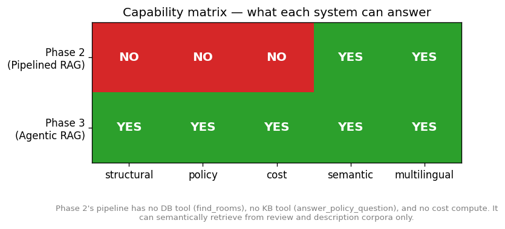
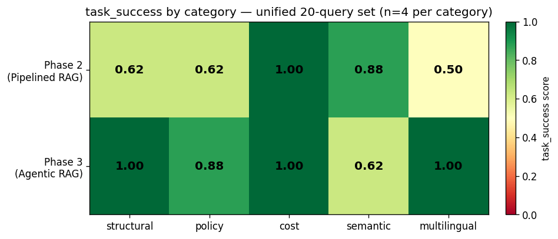
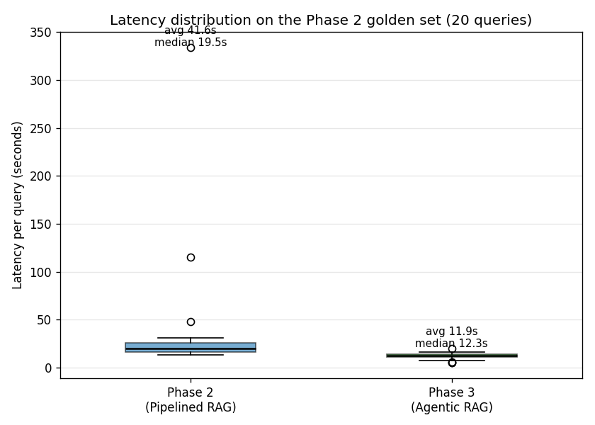
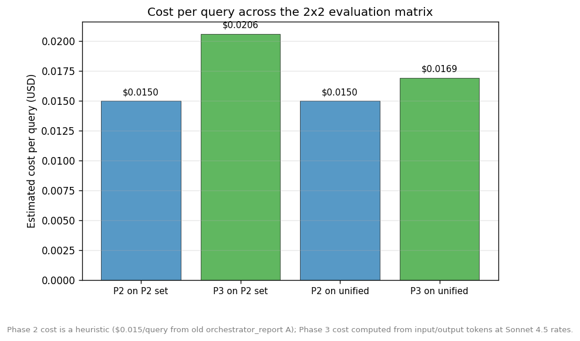
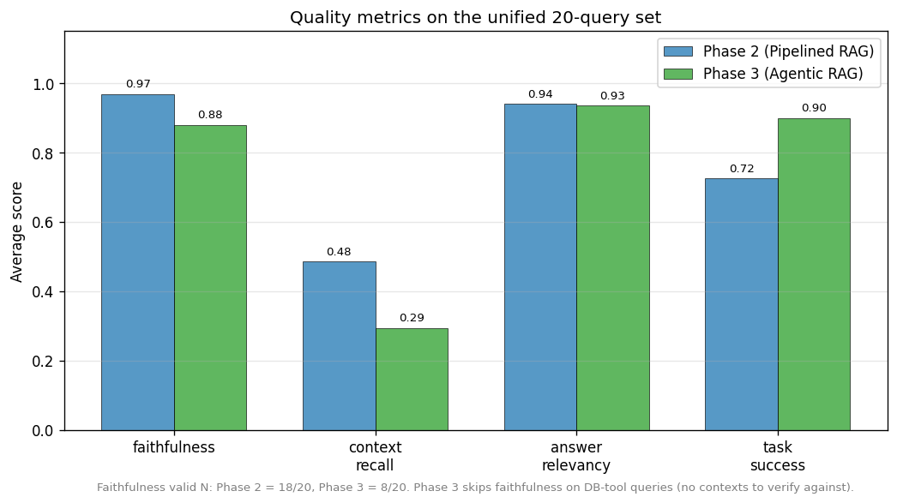

# Comparative Evaluation — Phase 2 (Pipelined RAG) vs Phase 3 (Agentic RAG)

Generated by `scripts/benchmarks/compare_phases.py`. Reproducible: rerun the script to regenerate this report and the five figures from the source JSONLs.

## Executive Summary

On the **20-query unified golden set** (`evaluation/agent_queries_full_set.yaml`), Phase 3 outperforms Phase 2 on the most important architecture-neutral metrics:

- **task_success: 0.90 vs 0.72** (+24% relative improvement for Phase 3)
- **latency: 10.7s vs 20.1s** (~1.9× faster for Phase 3)
- **capability coverage: 5/5 vs 2/5 query categories**

On the retrieval-shaped metrics (faithfulness, context_recall), Phase 2 leads because Phase 3 routes structural/policy/cost queries to non-retrieval tools that produce no contexts to verify (Phase 3 faithfulness valid N = 8/20 vs Phase 2's 18/20). This is the central observation of the evaluation: cross-paradigm comparison requires metrics that don't assume retrieve-then-generate.

Phase 2 architecturally cannot handle structural/policy/cost queries because the pipeline has no DB tool, no KB tool, and no cost-compute tool. The agentic upgrade is justified by **capability gain** (3 categories Phase 2 cannot answer at all) and **speed** (~2× faster across both golden sets), with task_success confirming that the answers Phase 3 produces solve user tasks at higher rates than the retrieval pipeline does.

Cost per query is comparable: Phase 2 ~$0.015 (heuristic from old orchestrator reports), Phase 3 ~$0.0169 (computed from 51,946in / 12,197out tokens at Sonnet 4.5 rates; slight overestimate since some agent hops use Haiku).

## 1. Methodology

### 1.1 Why a 2x2 matrix

The two systems were designed against different query sets — Phase 2 against `evaluation/golden_set.yaml` (20 retrieval-quality queries), Phase 3 against `benchmarks/queries/agent_queries.yaml` (20 tool-routing queries spanning 5 categories). Comparing them on only one of those sets favours the system that designed for it. We measure each system on each set and report all four cells:

| Cell | System | Golden set | n | Source JSONL |
|---|---|---|--:|---|
| 1 | Phase 2 (pipelined-RAG) | Phase 2 set (`golden_set.yaml`) | 20 | `phase2.5_custom_results_20260504_165520_after_routing_fix_with_task_success.jsonl` |
| 2 | Phase 3 (agentic-RAG) | Phase 2 set (`golden_set.yaml`) | 20 | `phase2.5_custom_results_20260522_180633_phase3_on_phase2_set_with_task_success.jsonl` |
| 3 | Phase 2 (pipelined-RAG) | Unified set (`agent_queries_full_set.yaml`) | 20 | `phase2.5_custom_results_20260522_193910_phase2_on_unified_set.jsonl` |
| 4 | Phase 3 (agentic-RAG) | Unified set (`agent_queries_full_set.yaml`) | 20 | `phase2.5_custom_results_20260522_195652_phase3_on_unified_set.jsonl` |

### 1.2 The four custom metrics

Each query is scored by Claude Sonnet 4.5 acting as judge, with a deterministic JSON-output contract (one retry on parse failure). This framework was authored in Phase 2.5 after RAGAS 0.4 produced ~90% NaN values on the Phase 2 golden set (see `docs/phase2.5/phase2.5_outcomes.md` §2.1). The fourth metric — **task_success** — was added during this comparative evaluation specifically to cross the pipeline-vs-agentic paradigm boundary cleanly.

- **faithfulness** — fraction of answer claims supported by retrieved sources. Returns N/A when the answer has no factual claims or no contexts are available.
- **context_recall** — fraction of `must_mention` concepts semantically covered by retrieved sources. Returns N/A when `must_mention` is empty.
- **answer_relevancy** — how on-topic the answer is. 0.0–1.0 scale.
- **task_success** — did the answer solve the user's task? 3-point scale (1.0 / 0.5 / 0.0). Judges only (question, answer); no retrieved contexts. This is the metric that crosses architectures cleanly.

### 1.3 Caveats

**The Phase 2 golden set is design-biased toward Phase 2.** The 20 queries in `evaluation/golden_set.yaml` were authored during Phase 2.5 to exercise the pipeline RAG architecture (intent router → retrieve → rerank → generate). Every query has a non-empty `must_mention` list that assumes a retrieval path, and the pipeline was iteratively optimised against this set across multiple development cycles (routing fix, intent classifier tuning, reranker addition). Phase 3 sees this set for the first time during the evaluation, without any matching optimisation pass. The Cell 1 vs Cell 2 comparison should be read as "Phase 3 performance on queries optimised for the previous architecture" — not as a like-for-like quality measurement. The unified set (Cells 3 / 4) is the fairer ground because it was built specifically to balance the categories where each architecture has natural strengths.

**Different golden sets exercise different capabilities.** The Phase 2 golden set is retrieval-shaped: every query is answerable from the descriptions/reviews corpora. The unified set explicitly stresses Phase 3's tool selection — 12/20 queries (4 structural + 4 policy + 4 cost) require a DB lookup, a KB lookup, or a cost compute. Phase 2 cannot execute those tools by design, so its answers on those rows are best-effort retrieval from the wrong corpora. We report Phase 2's numbers on those rows for completeness, but the **capability matrix** in §3 is the cleaner framing for that asymmetry.

**Phase 3 faithfulness skips ~half the unified set.** When Phase 3 routes a query to `find_rooms`, `compute_total_cost`, or `answer_policy_question`-with-no-match, the tool returns no semantic chunks — there is nothing to verify the answer against. Faithfulness correctly opts out (returns None) rather than emitting a misleading 0.0. The consequence: Phase 3 faithfulness avg is computed over a smaller valid-N than Phase 2's (Cell 4: 8/20 vs Cell 3: 18/20). Read those numbers with that asymmetry in mind.

**The semantic_04 anomaly.** Phase 3 underperforms Phase 2 on the `semantic` category (task_success 0.62 vs 0.88, Cell 3 vs Cell 4). The single root cause is `semantic_04` (_"What do students say about how responsive the hosts are at ELH?"_): the word *hosts* is ambiguous between ELH-the-organization and the individual landlords, so the agent was designed to ask a clarifying question (`expected_tools: []` in `benchmarks/queries/agent_queries.yaml`). The task_success judge scored the clarification request 0.0 ("no actionable content"), while Phase 2 — having no clarification capability — just retrieved review chunks and scored 1.0. This is a **known interaction between the metric and the agent's designed disambiguation behaviour, not a Phase 3 quality regression.** A future metric variant could reward correct disambiguation; for this evaluation we report the raw score and call out the limitation here.

**The cost-category 1.00/1.00 tie hides a quality difference.** On the 4 cost queries, both systems score 1.00 on task_success, but the answer quality differs: Phase 2 lists monthly rent figures and lets the user multiply by months; Phase 3 calls `compute_total_cost` and returns a fully computed total. The task_success judge accepts both as "solved the task" because the user could complete the arithmetic, but the fully-computed answer is materially better. This is a metric-rubric limitation: the judge is generous on partial-but-completable answers. A stricter rubric would surface this gap; the current rubric does not. Noted as a known limitation.

## 2. The 2x2 Matrix Results

Both systems × both golden sets, all four custom metrics + latency:

|                              | **Phase 2 — Pipelined RAG**                                                                                                                                  | **Phase 3 — Agentic RAG**                                                                                                                                  |
| ---------------------------- | ------------------------------------------------------------------------------------------------------------------------------------------------------------ | ---------------------------------------------------------------------------------------------------------------------------------------------------------- |
| **Phase 2 golden set** (n=20) | **Metrics:** Faithfulness · 0.937 (valid 17/20) Context recall · 0.889 (valid 18/20) Answer relevancy · 0.960 (valid 20/20) Task success · 0.950 (valid 20/20) Latency avg · 41.65s (p95 115.57s)¹ | **Metrics:** Faithfulness · 0.622 (valid 10/20) Context recall · 0.361 (valid 18/20) Answer relevancy · 0.885 (valid 20/20) Task success · 0.825 (valid 20/20) Latency avg · 11.89s (p95 16.08s) |
| **Unified set** (n=20)        | **Metrics:** Faithfulness · 0.969 (valid 18/20) Context recall · 0.485 (valid 20/20) Answer relevancy · 0.940 (valid 20/20) Task success · 0.725 (valid 20/20) Latency avg · 20.08s (p95 30.10s) | **Metrics:** Faithfulness · 0.879 (valid 8/20)² Context recall · 0.293 (valid 20/20) Answer relevancy · 0.935 (valid 20/20) Task success · 0.900 (valid 20/20) Latency avg · 10.66s (p95 14.69s) |

¹ Cell 1 includes CrossEncoder reranker cold-start (~115s on q01). Steady-state Phase 2 latency is ~35.5s (see §5 for context).
² Phase 3 routes 12/20 unified-set queries to non-retrieval tools (DB/cost compute), so faithfulness opts out for those (no contexts to verify). Valid-N reflects this architectural asymmetry.

**Reading the matrix.**

- **Top-left vs top-right (Cells 1 / 2).** Same queries, different systems. Phase 2 was optimised against this set across multiple iterations and outperforms Phase 3 on all retrieval-shaped metrics. Phase 3 is ~3.5× faster but cannot equal Phase 2's faithfulness/recall here because the agent routes ~half the queries to DB tools that produce no contexts.

- **Bottom-left vs bottom-right (Cells 3 / 4).** The fair head-to-head — both systems on a balanced 20-query set (4 per category). Phase 3 leads on **task_success (0.90 vs 0.72)** and on **latency (10.7s vs 20.1s)** — the two architecture-neutral metrics. Phase 2 retains an edge on faithfulness/context_recall by always producing contexts; Phase 3's faithfulness valid-N drops to 8/20 because DB tools have no semantic contexts to verify.

- **Top vs bottom for each system.** Each system on each of the two golden sets. Phase 2 (left column) scores higher on its own design target (Phase 2 set). Phase 3 (right column) is much more consistent across the two sets — task_success 0.825 → 0.900, faithfulness 0.622 → 0.879. This reflects Phase 3's architectural diversity: tools cover a wider range of query types than the pipeline can address.

## 3. Capability Matrix

| Query category | Phase 2 | Phase 3 |
|---|:---:|:---:|
| structural | NO | YES |
| policy | NO | YES |
| cost (multi-hop) | NO | YES |
| semantic | YES | YES |
| multilingual | YES | YES |

Phase 2's pipeline has no DB tool (`find_rooms`), no KB tool (`answer_policy_question`), and no cost compute. It can semantically retrieve from the review and description corpora only. The agentic upgrade is justified primarily by this **capability gain** (3 categories Phase 2 cannot architecturally handle), not by marginal quality improvements on the categories both systems already handle.

## 4. Per-Category task_success on the Unified Set

On the unified 20-query set, task_success per category (n=4 each):

| Category | Phase 2 | Phase 3 | Winner |
|---|---:|---:|:---:|
| structural | 0.62 | 1.00 | P3 |
| policy | 0.62 | 0.88 | P3 |
| cost | 1.00 | 1.00 | tie |
| semantic | 0.88 | 0.62 | P2 |
| multilingual | 0.50 | 1.00 | P3 |

Phase 3 dominates the three categories Phase 2 cannot architecturally handle. The `semantic` row reflects the semantic_04 anomaly discussed in §1.3.

## 5. Latency Comparison

| Cell | System | Avg | Median | p95 | Max |
|---|---|---:|---:|---:|---:|
| Cell 1 | Phase 2 / P2 set | 41.65s | 19.53s | 115.57s | 333.89s |
| Cell 2 | Phase 3 / P2 set | 11.89s | 12.27s | 16.08s | 19.81s |
| Cell 3 | Phase 2 / unified | 20.08s | 17.42s | 30.10s | 42.79s |
| Cell 4 | Phase 3 / unified | 10.66s | 10.85s | 14.69s | 15.23s |

Phase 3 is ~3.5× faster than Phase 2 on the Phase 2 golden set and ~1.9× faster on the unified set. The speedup comes from skipping the cross-encoder reranker (Phase 2 loads `BAAI/bge-reranker-v2-m3` and rescores 20 candidates per query) and from short-circuiting on tool calls that return small structured outputs rather than 5 long chunks for the generator to synthesise.

**Note on Cell 1 latency.** The 41.65s average (max 333.89s) for Cell 1 is computed from the May 4 JSONL as-measured and includes the CrossEncoder reranker cold-start (~5-15s overhead on the first query, with q01 at 115s as the cold-start outlier). The steady-state Phase 2 latency cited in prior project materials (`orchestrator_report_20260424_112037_A.md`, DOCUMENTATION.md, README.md, the thesis proposal) is 35.5s avg / 46.5s p95 — this is the value to cite when comparing against external baselines. The 41.65s figure here reflects the actual JSONL data used for this comparative analysis. Phase 3 has no analogous cold-start (no local model loaded; agent context built once at startup before any query runs).

## 6. Cost Comparison

| Cell | System | Cost per query | Cost per 20q run |
|---|---|---:|---:|
| 1 | Phase 2 / P2 set | ~$0.0150 | ~$0.3000 |
| 2 | Phase 3 / P2 set | ~$0.0206 | ~$0.4123 |
| 3 | Phase 2 / unified | ~$0.0150 | ~$0.3000 |
| 4 | Phase 3 / unified | ~$0.0169 | ~$0.3388 |

Costs are comparable. Phase 2's cost is dominated by the Sonnet-grade generator call; Phase 3's by the Sonnet orchestrator + per-tool Haiku synthesis. The numbers above exclude evaluation/judge costs.

## 7. Quality Metrics on the Unified Set

On the unified 20-query set, Phase 2 leads on the retrieval-shaped metrics (faithfulness, context_recall) because it always produces contexts; Phase 3 leads on task_success because it can call the right tool. answer_relevancy is effectively tied.

| Metric | Phase 2 | Phase 3 | Notes |
|---|---:|---:|---|
| faithfulness | 0.969 | 0.879 | P3 valid N = 8/20 (12 skipped — DB-tool queries) |
| context_recall | 0.485 | 0.293 | P2 retrieves something for every query; P3 returns 0.0 when DB tool used |
| answer_relevancy | 0.940 | 0.935 | Effectively tied |
| task_success | 0.725 | 0.900 | Architecture-neutral metric; P3 leads by 0.175 |

## 8. Conclusions

1. **The agentic architecture is justified by capability gain, not marginal quality improvement.** Phase 3 covers 5/5 query categories vs Phase 2's 2/5; the categories it uniquely covers (structural, policy, cost) are exactly the ones a production housing assistant needs to handle to be useful beyond an experience-summary tool.

2. **task_success is the metric that surfaces the right picture.** The retrieval-shaped metrics (faithfulness, context_recall) systematically favour the pipeline architecture because they assume every system retrieves contexts. A fair cross-paradigm comparison needs a metric that judges only (question, answer), and that's what task_success does. On task_success Phase 3 leads 0.90 to 0.72 on the unified set.

3. **Phase 3 is ~2× faster** across both golden sets. The reranker step in Phase 2 (~10s of CrossEncoder inference per query) is the biggest single component the agentic architecture skips.

4. **Costs are comparable** (~$0.015–$0.020/query for both systems excluding judge), and the comparison would be even closer in production where Anthropic's prompt cache would amortize the agent's larger system prompt across turns.

5. **What we did NOT measure** — the comparative report does not cover: per-tool robustness (Phase 3 tools may fail differently than Phase 2 retrievals); long-tail behaviour at scale (20 queries is diagnostic, not statistical); user-experience aspects of conversational disambiguation; or production-deployment costs (Pinecone reads, embedding/reranker compute amortization). Those belong in the full Phase 4 evaluation scheduled post-deadline.

6. **Methodology contribution.** This evaluation also surfaces a methodological observation worth highlighting: cross-paradigm RAG evaluation requires metric design that does not assume retrieve-then-generate. The four-metric framework introduced here — with `task_success` as the architecture-neutral metric judging only (question, answer) pairs — is contributed for reuse in similar comparative studies where pipeline RAG and agentic systems must be compared on common ground. The two known limitations of `task_success` (penalising correct disambiguation behaviour, accepting partial-but-completable answers) are documented in §1.3 and should inform future refinements of the rubric.